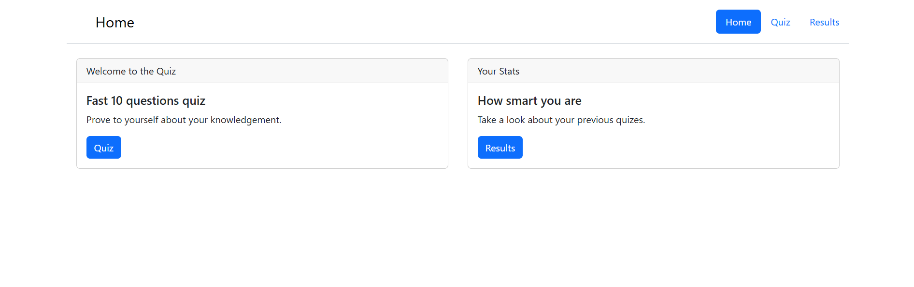
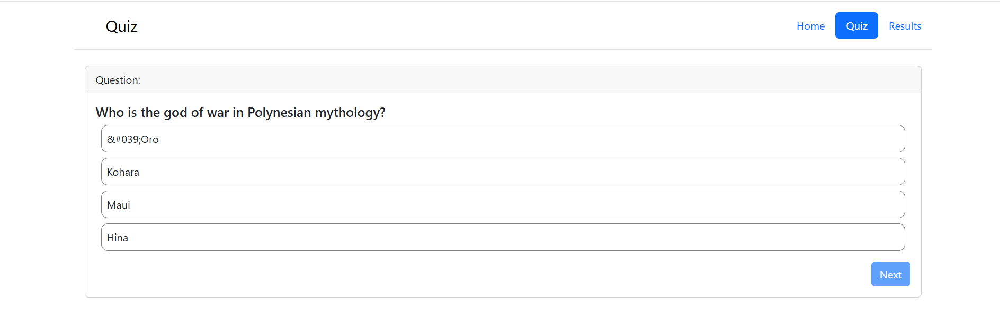
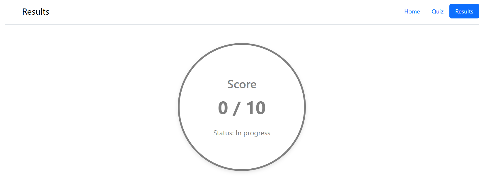
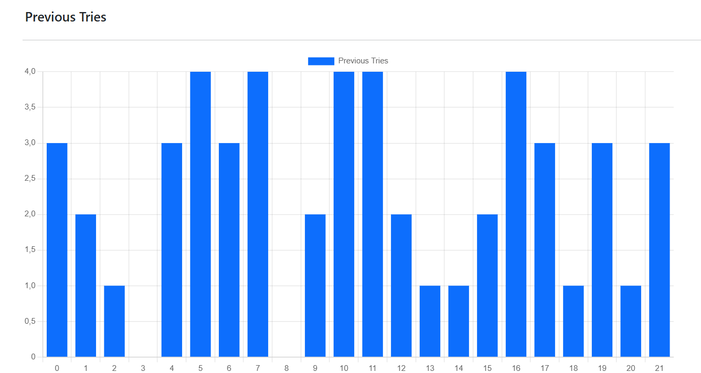

# Quiz App

## Descripción

Esta aplicación web es un quiz interactivo de 10 preguntas que consume datos de la API [Open Trivia Database](https://opentdb.com/). La aplicación permite a los usuarios realizar un quiz de preguntas de opción múltiple, ver los resultados obtenidos, y visualizar estadísticas de los intentos previos mediante una gráfica de barras. Además, los resultados se almacenan en `localStorage` para mantener un historial de puntajes.

## Características

- Interfaz dinámica que permite cambiar entre vistas (Home, Quiz y Results) mediante eventos de clic.
- Obtención de 10 preguntas aleatorias de la API de trivia.
- Validación de respuestas y corrección de preguntas falladas.
- Visualización de resultados anteriores mediante una gráfica de barras utilizando `Chart.js`.
- Almacenamiento de puntajes en `localStorage` para poder llevar un historial de intentos previos.
- Modales que muestran detalles de cada pregunta al finalizar el quiz.
  
## Requisitos

Para que el proyecto funcione correctamente, necesitas lo siguiente:

- Conexión a internet (para cargar las bibliotecas externas y la API de trivia).
- Un navegador que soporte las tecnologías de **JavaScript** moderno y **localStorage**.

### Librerías y tecnologías usadas:

- [Axios](https://axios-http.com/) para realizar las peticiones HTTP.
- [Bootstrap 5.3](https://getbootstrap.com/) para la interfaz de usuario.
- [Chart.js](https://www.chartjs.org/) para mostrar las gráficas de estadísticas.

## Estructura de Archivos

```bash
├── index.html    # Archivo principal de la aplicación
├── index.js      # Lógica principal en JavaScript
├── index.css     # Estilos personalizados de la aplicación
├── README.md     # Este archivo

## Funcionalidades

### Navegación entre secciones

El proyecto tiene tres secciones principales que se navegan mediante la barra de navegación:

- **Home**: Pantalla de bienvenida donde se puede iniciar el quiz o ver las estadísticas.
- **Quiz**: Muestra las preguntas y las opciones de respuesta.
- **Results**: Muestra los resultados del quiz y una gráfica de los intentos previos.

### Iniciar el Quiz

1. En la vista **Home**, hacer clic en el botón **Quiz**.
2. La aplicación obtiene 10 preguntas de opción múltiple de la API.
3. El usuario selecciona una respuesta por cada pregunta.
4. Al finalizar, se muestran los resultados y el puntaje en la sección **Results**.

### Resultados y Estadísticas

- Las respuestas correctas se muestran en color verde y las incorrectas en color rojo.
- La sección **Results** muestra una gráfica de barras con los puntajes de intentos previos guardados en `localStorage`.

## Requisitos

Para que el proyecto funcione correctamente, necesitas lo siguiente:

- Conexión a internet (para cargar las bibliotecas externas y la API de trivia).
- Un navegador que soporte las tecnologías de **JavaScript** moderno y **localStorage**.

### Librerías y tecnologías usadas:

- [Axios](https://axios-http.com/) para realizar las peticiones HTTP.
- [Bootstrap 5.3](https://getbootstrap.com/) para la interfaz de usuario.
- [Chart.js](https://www.chartjs.org/) para mostrar las gráficas de estadísticas.

## Instalación

No requiere instalación. Simplemente abre `index.html` en un navegador moderno para ejecutar la aplicación.

## Estructura de Archivos

```bash
├── index.html    # Archivo principal de la aplicación
├── index.js      # Lógica principal en JavaScript
├── index.css     # Estilos personalizados de la aplicación
├── img           # donde guardaremos las imagenes que mostraremos en este archivo
├── README.md     # Este archivo

## Vistas de la Aplicación

A continuación se muestran las diferentes pantallas de la aplicación con sus respectivas funcionalidades.

### 1. Pantalla Principal (Home)
Esta es la pantalla de bienvenida, donde el usuario puede elegir iniciar el quiz o ver los resultados de intentos anteriores.



### 2. Pantalla del Quiz
En esta sección, el usuario responde las preguntas de opción múltiple. Cada pregunta se obtiene de una API de trivia. Al seleccionar una opción, se habilita el botón "Next" para pasar a la siguiente pregunta.



### 3. Pantalla de Resultados
Al finalizar el quiz, el usuario puede ver sus respuestas correctas e incorrectas. Las respuestas correctas se destacan en verde, y las incorrectas en rojo. También se muestra el puntaje y un estado (aprobado o fallado) basado en el resultado.



### 4. Gráfica de Intentos Previos
La aplicación guarda el historial de intentos anteriores en el `localStorage`. Esta gráfica de barras muestra los puntajes de esos intentos anteriores.


